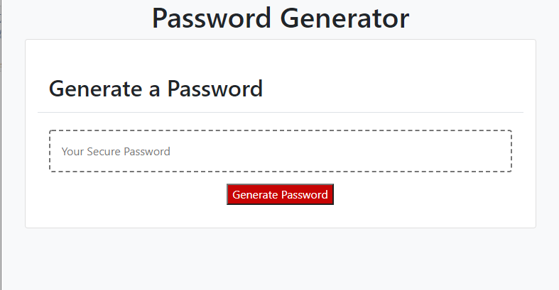

# Password Generator

Password generator is a web page that takes input from the user to generate new password given a set of criteria. The application will generate a new password with randomized characters and display it in the page.

## Instructions

Just clic the "Generate Password" button and the browser will ask you how many characters the password would be, then the application will ask you to confirm or deny if the passworld will include lower case letters, upper case letters, numbers and special characters. You must to accept to at least one of this criteria to get a password.

The new password will display in the page.

## Password Generator link
https://jpineda30.github.io/Password_Generator/

